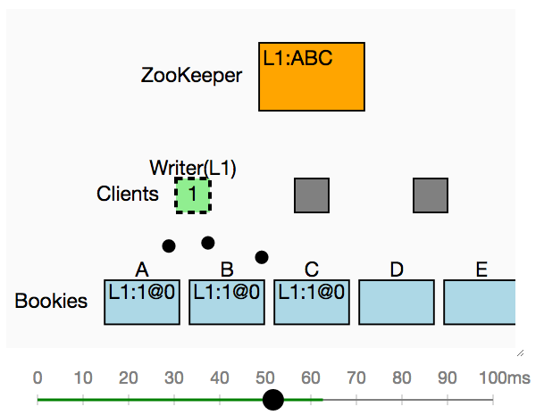

# Model of Apache BookKeeper for Runway

[try this model in Runway](https://runway.systems/?model=github.com/salesforce/runway-model-bookkeeper)

This is a model of [BookKeeper](http://bookkeeper.apache.org/) for
[Runway](https://github.com/salesforce/runway-browser). It includes a
`.model` file describing the state and how it changes, as well as a `.js` file
which can be used with
[runway-browser](https://github.com/salesforce/runway-browser) to produce an
interactive visualization.
